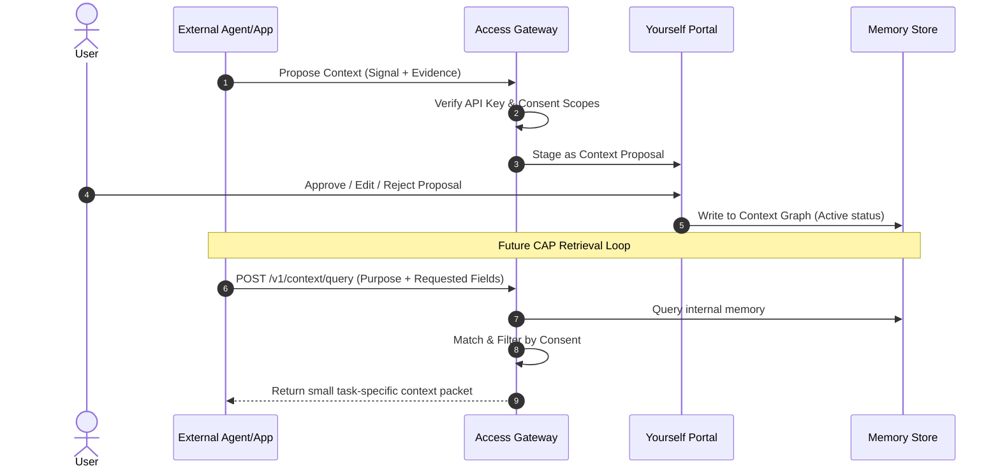

# Memact Architecture Specification

Memact is a persistent, portable, user-owned context and identity layer for the AI era. It decouples user context from specific AI models, client applications, and platform silos, giving the user absolute authority over what agents know about them.

---

## 1. System Philosophy

1. **Identity survives models:** AI engines and applications are temporary. User identity is persistent.
2. **Activity is not identity:** Telemetry and behavioral logs do not automatically write to identity. They are suggestions that require evidence and final user approval.
3. **Context is portable:** Approved context is shared across ChatGPT, Claude, Gemini, Cursor, and other agents to eliminate identity fragmentation.
4. **Task-specific relevance (CAP):** Instead of classic OAuth (*"What data can this app read/write?"*), Memact solves context relevance (*"What should this agent know about this human for this specific task?"*).

---

## 2. Repository Spine & Boundaries

The architecture is distributed across modular submodules:

```txt
Access (Gateway) ──> Context/Schema (Matching) ──> Yourself (User Portal) ──> Memory (Store) ──> SDK/Apps
```

* **Access (API Gateway):** Manages API keys, connection consent, scopes, and queries. It is the gatekeeper for all agent requests.
* **Context/Schema (Engine):** Open-source semantic category layer. Defines groups, subgroups, and runs the `LocalContextMatcher` (Jaro-Winkler + stemming).
* **Yourself (User Interface):** The governance console. Users review context suggestions, manage connected apps, and edit stored claims.
* **Memory (Storage):** The local-first database storing approved claims, evidence links, and credentials.
* **SDK:** Libraries for server-side and client-side integrations.

---

## 3. The Core Product Loop



### A. Context Proposal
1. An app observes user behavior (e.g. Cursor editing TypeScript files) and proposes a claim.
2. Access checks the app's API keys and scopes.
3. The proposal is stored as a pending wiki suggestion.

### B. User Governance
1. The user opens the Yourself portal, sees the suggestion and the associated evidence, and chooses to approve, edit, or reject it.
2. Accepted suggestions graduate into the Memory Store.

### C. Stateful Query
1. An app requests context by posting its `Purpose` and `requested_context`.
2. Access queries the user's stored memories, filters them by consent, matches them semantically, and returns only the relevant subset.
