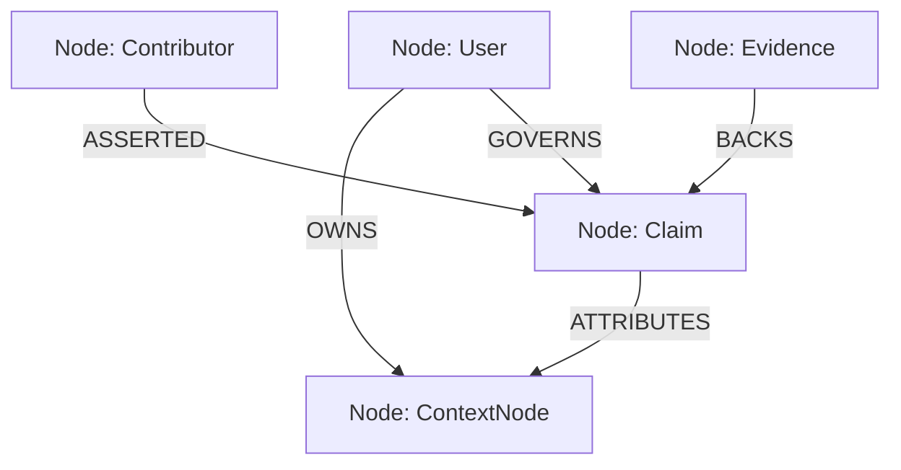

# Identity Graph Model (`GRAPH_MODEL.md`)

This document defines the property graph model representing a user's multi-perspective identity. The graph structure decouples context assertions from truth value and associates evidence directly with the assertions.

---

## 1. Graph Schema Design

---

## 2. Node Schema Definitions

### A. User Node
Represents the primary user identity anchor.
* **Properties:**
  - `user_id` (UUID): Unique user identifier.
  - `username` (text): Slug corresponding to the Identity URL (e.g. `sujay`).
  - `created_at` (timestamp)

### B. ContextNode (semantic field path)
Represents a specific domain context node defined by the open-source Context layer schema.
* **Properties:**
  - `node_path` (text): Dot-separated path (e.g., `learning.stable_preferences.preferred_format`).
  - `category` (text): Category grouping (e.g., `learning`, `shopping`, `fitness`, `identity`).
  - `description` (text)

### C. Claim Node
An assertion of a value or preference linked to a ContextNode.
* **Properties:**
  - `claim_id` (UUID): Unique claim identifier.
  - `value` (jsonb/text): The stated preference value.
  - `status` (text): `proposed`, `active`, `stale`, `archived`.
  - `confidence` (numeric): Computed score between `0.0` and `1.0`.
  - `updated_at` (timestamp)
  - `expires_at` (timestamp/null)

### D. Evidence Node
The metadata and telemetry backing a claim.
* **Properties:**
  - `evidence_id` (UUID)
  - `evidence_type` (text): `telemetry_aggregate`, `onboarding_input`, `peer_assertion`.
  - `trust_value` (numeric): Static strength metric between `0.0` and `1.0`.
  - `assertion_summary` (text): Natural-language text explaining the evidence (e.g., `"Edited 45 TypeScript files over 5 days."`).
  - `hash` (text): SHA-256 hash of the originating interaction logs for verification.

### E. Contributor Node
The entity (app, agent, organization, or user) proposing the claim.
* **Properties:**
  - `contributor_id` (text): Unique name/slug (e.g. `app_cursor_1`).
  - `contributor_type` (text): `user`, `domain_agent`, `app`, `friend`, `org`.
  - `domain_expertise` (text[]): List of categories where they have authority (e.g. `["coding.*"]`).
  - `reputation` (numeric): Trust coefficient between `0.0` and `1.0`.

---

## 3. Relationship Schema Definitions

* **`User -[OWNS]-> ContextNode`**
  - Defines the user's personal context namespace.
* **`Contributor -[ASSERTED]-> Claim`**
  - Connects the claim to its originator.
  - **Properties:**
    - `asserted_at` (timestamp)
    - `contributor_signature` (text): Cryptographic signature proving provenance.
* **`Evidence -[BACKS]-> Claim`**
  - Attaches telemetry and quality proof to a claim.
* **`Claim -[ATTRIBUTES]-> ContextNode`**
  - Connects the claim assertion to the semantic path.
* **`User -[GOVERNS]-> Claim`**
  - Defines the user's specific privacy controls for this claim.
  - **Properties:**
    - `visibility` (text): `private`, `shareable`, `public`.
    - `allowed_apps` (UUID[]): Explicit exclusions or inclusions.
